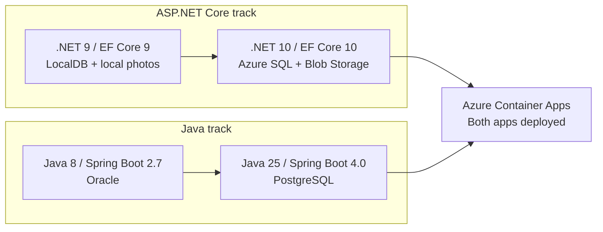

# Modernize Your Apps with GitHub Copilot

_Upgrade ASP.NET Core and Java photo-album apps, then take both to Azure._

Work through a real modernization journey with GitHub Copilot as your coding
partner. You'll explore the apps, plan small changes, upgrade their frameworks,
move their data, and deploy them with GitHub Actions.

The central idea is **small changes, clear feedback, and you in control**.
Keep photo uploads, browsing, and deletion working as the technology changes.

## Welcome

- **Who is this for**: Developers familiar with basic Git, pull requests, and .NET or Java.
- **What you'll learn**: Track-scoped Copilot prompts, framework upgrades, cloud data migration, automated review, and approved deployments.
- **What you'll build**: Two modernized photo-album apps running on Azure Container Apps.
- **Prerequisites**: A GitHub account with Copilot, Codespaces, and Actions available; an Azure subscription and permission to configure the lab.
- **Included toolchain**: .NET 9/10, Java 8/25, Maven, Node.js, GitHub CLI, and Azure CLI in a ready-to-use Dev Container.
- **How long**: Allow 4-6 hours, plus Azure setup and provisioning time.

In this exercise, you will:

| Step | Focus |
| --- | --- |
| **1. Get familiar** | Explore each app and its tests, then set boundaries for your AI assistant. |
| **2. Make a plan** | Find upgrade and cloud-readiness gaps and agree on a small, reviewable plan. |
| **3. Upgrade the code** | Update each framework without losing existing behavior. |
| **4. Move the data** | Use Azure SQL and Blob Storage for .NET, and PostgreSQL for Java. |
| **5. Add an AI review** | Prepare a limited, read-only review workflow and decide which findings to act on. |
| **6. Go live** | Approve the Azure deployment and exercise both apps' photo features. |

This repository is the **learner starter**, not the completed solution. The apps,
development tools, lesson coach, and deployment workflows are provided.
**You make the upgrades and cloud migrations** with Copilot's help.

## How to start this exercise

Copy the exercise to your account. Leave Issues and Actions enabled, and give the
initial workflow time to create your first lesson.

[](https://github.com/new?template_owner=ragmha&template_name=modernize-app-with-copilot&owner=%40me&name=my-app-modernization&description=Hands-on+ASP.NET+and+Java+modernization+with+GitHub+Copilot&visibility=public)

Create a **new repository from the template**, not a fork. In your new repository,
open **Issues -> Exercise: Modernize both apps with Copilot**.
The coach posts lessons there and provides feedback as you merge your work.

### Recommended: open a Codespace

The Dev Container includes the development tools, so you can work in your browser
without installing .NET and Java on your own computer.

1. In **your copied repository**, select **Code -> Codespaces**.
2. Create a Codespace with at least **4 cores and 16 GB RAM**.
3. Wait for setup to finish and sign in to Copilot in VS Code.
4. Open your exercise issue and begin Step 1. It also contains a Codespaces link for your own copy.

Codespaces usage counts toward your account's allowance.

### Local Dev Container setup

Prefer your desktop editor? Open your copied repository in VS Code with Docker
and the Dev Containers extension, then select **Dev Containers: Reopen in Container**.
Inside the container, run:

```bash
npm run lab -- doctor
npm run lab -- test dotnet
npm run lab -- test java
```

Database services are not started automatically. Follow the
[local setup guide](docs/codespaces.md) when you're ready to explore the apps' UI.

<details>
<summary>Having trouble?</summary>

- Use a repository where you can run Actions and manage the exercise.
- Public repositories simplify sharing; private repositories use the owner's Actions allowance.
- Check [Actions](../../actions) if the lesson issue does not appear.
- You can manually run **Exercise coach** with `preview` left off.
- If progress gets stuck, comment `/check` on your exercise issue.
- Keep changes in small pull requests and review Copilot's work before merging.

</details>

## Tracks at a glance

Work on one track at a time, then repeat the process for the other.
**Both apps must be deployed to finish the exercise.**



### Keep Copilot focused on your current track

Use a separate prompt for each app rather than asking for one combined assessment.
Each prompt names its source folder and leaves the other app untouched.

| Track | Work in | Start with |
| --- | --- | --- |
| **ASP.NET Core** | `apps/dotnet` | [The .NET assessment prompt](.github/steps/1-baseline.md#aspnet-core-track) |
| **Java** | `apps/java` | [The Java assessment prompt](.github/steps/1-baseline.md#java-track) |

You can start with the language you know best. Keep the assessments and code
changes separate, then bring the results together for the final review and deployment.

## Safety and scope

Copying this repository **does not create Azure resources**. Deployment happens
later, after you configure the lab and explicitly approve it.
Follow the [Azure setup and cleanup guide](docs/azure-setup.md) before deploying.

Use made-up photos and exercise-only credentials. Keep passwords and tokens out
of commits, reports, and screenshots. These are learning apps, not production-ready systems.

Live automated AI review is optional and needs separate Copilot authentication.
The [AI review guide](docs/agentic-workflows.md) explains how to enable it.
Deploying both apps to Azure is required.

Codespaces, Copilot, Actions, and Azure can incur separate charges. Databases,
storage, and other Azure services may keep billing while the apps are idle.
Stop your Codespace and clean up the lab when finished; budget alerts are not spending caps.

## Project map

| Path | Purpose |
| --- | --- |
| `apps/dotnet` | ASP.NET Core app and its tests |
| `apps/java` | Java app and its tests |
| `.devcontainer` | Shared development environment |
| `.github/steps` | Guided lessons and track-specific prompts |
| `.github/agents` | Read-only modernization coach |
| `.github/workflows` | Lesson feedback, CI, optional AI review, and Azure deployment |
| `infra` | Azure infrastructure definitions |
| `scripts` | Local setup, exercise progress, and deployment helpers |
| `evidence` | Your assessments, plans, and decisions |
| `docs` | Setup, deployment, and troubleshooting guides |

## Useful commands

Run these inside your Codespace or Dev Container:

```bash
# Explore the available tools
npm run lab -- doctor

# Work on one track at a time
npm run lab -- test dotnet
npm run lab -- test java

# Run both tracks before merging
npm run lab -- test both

# Check a lesson's required files; change 3 to your current step (1-5)
npm run checkpoint -- 3

# Compile the optional AI review workflow without running a model
npm run compile:review
```

Your exercise issue is the main guide. You can also [browse all the lessons](.github/steps)
at any time.

## Project status and disclaimer

This is an independent personal project maintained by `ragmha`. It is not
affiliated with, endorsed by, or sponsored by any employer or organization.

The material is intended for learning and demonstration and is provided "as is",
without warranty. Review the code and configuration before use. You are responsible
for obtaining the required permissions, securing your environment, and managing
any cloud or AI usage charges.

## License

Original exercise content and tooling are licensed under the [MIT License](LICENSE).
Copyright (c) 2026 ragmha.

Third-party sample code, assets, and dependencies retain their own licenses and
copyright notices. See the [third-party license notices](third_party/README.md)
for details.
